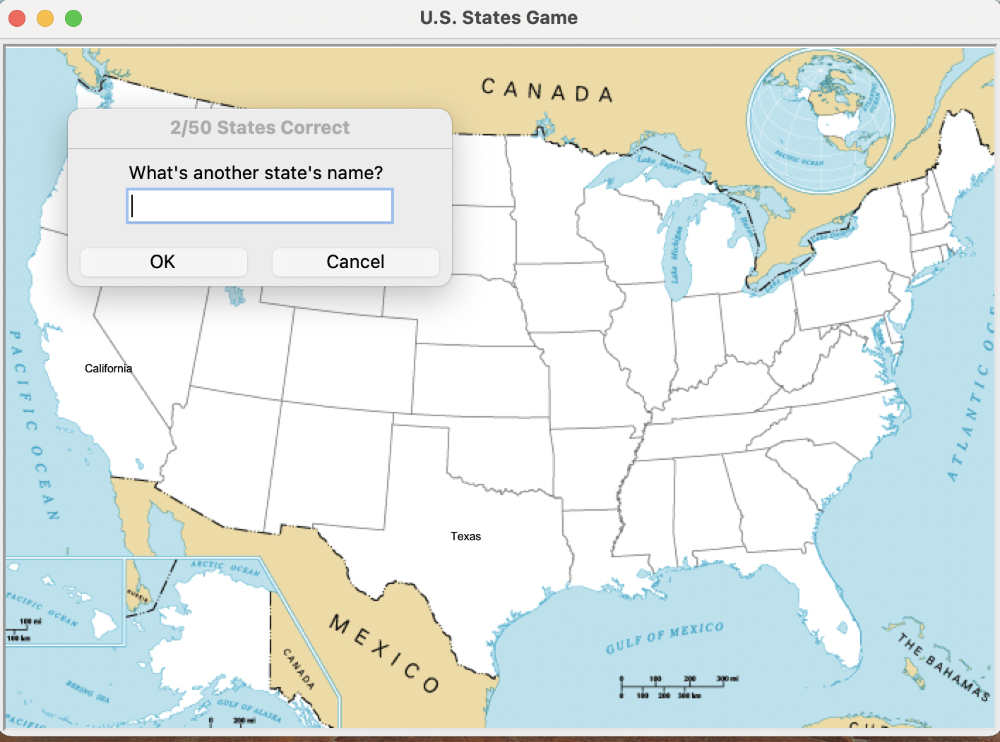

# us-states-game

This US State Guessing Game is part of the 100 Days of Code - The Complete Python Pro Bootcamp.

The idea of the game comes from https://www.sporcle.com/games/g/states. This toy game asks the player to take a guess for a U.S. state. If the player guesses it correctly, the name of the U.S. State will show up on the map. The game ends when the user gets all 50 states. If the user decides to quit, the game ends, and the states that the user failed to recall is stored in states_to_learn.csv

## GUI Demo

  

